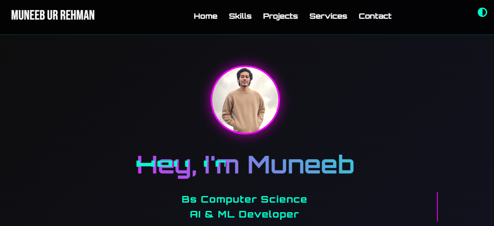

# 🌐 Digital Me - Portfolio Website

Welcome to my personal portfolio website — a space where I showcase my skills, projects, and passion for web development and technology.

## 🔗 Live Demo

You can view the live versions of this website here:

- 🌍 GitHub Pages: [muneebinu.github.io/digital-me](https://muneebinu.github.io/digital-me/)
- 🚀 Netlify: [muneebml.netlify.app](https://muneebml.netlify.app/)

## 📌 Description

This website serves as my digital identity, presenting my resume, projects, and contact information in a sleek and responsive design. It’s built to reflect both creativity and professionalism.

## 🚀 Features

- Responsive layout for all screen sizes
- Clean UI/UX design
- Smooth scrolling and animations
- Project showcase section
- Contact form

